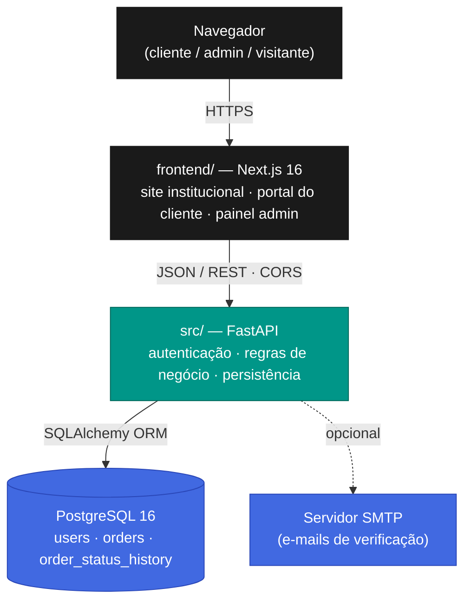
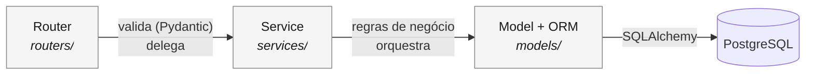
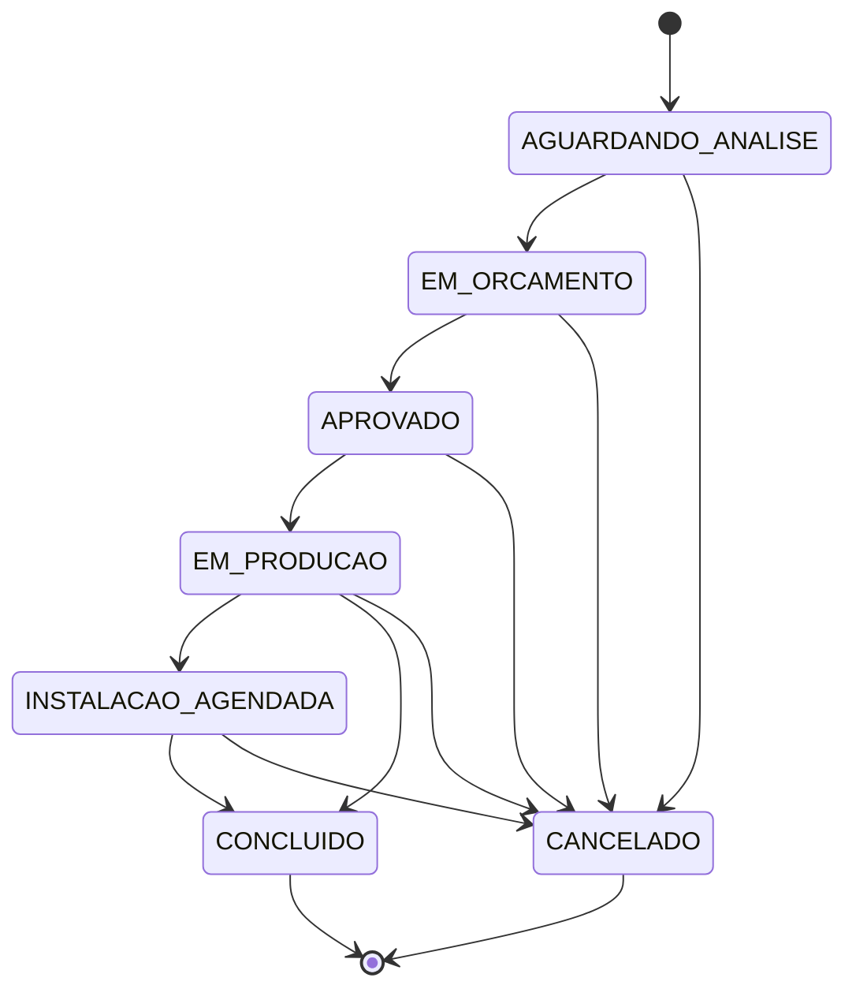

<div align="center">

# Ramos Planejados — Plataforma de Gestão de Pedidos

**Sistema fullstack para uma marcenaria de móveis planejados gerenciar todo o ciclo de vida de um pedido — do orçamento à instalação.**

Substitui o controle informal por WhatsApp e planilhas por uma plataforma estruturada, com portal do cliente, painel administrativo e API REST documentada.

<br>

[](https://github.com/jgabrielflores/marcenaria-api/actions/workflows/ci.yml)
[](https://codecov.io/gh/jgabrielflores/marcenaria-api)


<br>


</div>

---

> [!NOTE]
> **Projeto de portfólio.** Aplicação fullstack desenvolvida com foco em engenharia de software:
> arquitetura em camadas, máquina de estados, segurança aplicada (OWASP), pipeline de CI
> e suíte de testes automatizados.

<br>

## Sumário

- [Visão geral](#visão-geral)
- [Demonstração](#demonstração)
- [Principais funcionalidades](#principais-funcionalidades)
- [Arquitetura](#arquitetura)
- [Stack tecnológica](#stack-tecnológica)
- [Estrutura do repositório](#estrutura-do-repositório)
- [Ciclo de vida do pedido](#ciclo-de-vida-do-pedido)
- [Como executar](#como-executar)
- [Variáveis de ambiente](#variáveis-de-ambiente)
- [Qualidade e testes](#qualidade-e-testes)
- [Segurança](#segurança)
- [Documentação completa](#documentação-completa)
- [Roadmap](#roadmap)
- [Aprendizados técnicos](#aprendizados-técnicos)
- [Autor](#autor)

<br>

## Visão geral

### O problema

Marcenarias de pequeno porte coordenam pedidos por canais informais — conversas de WhatsApp, e-mail e planilhas soltas. Disso decorrem três dores concretas:

| Dor | Consequência |
|---|---|
| **Pedidos perdidos** | Solicitações de orçamento chegam em canais diferentes e se perdem. |
| **Status opaco** | O cliente não consegue acompanhar o andamento sem ligar para a oficina. |
| **Sem visão de carga** | O dono não enxerga, de relance, o que está pendente, em produção ou concluído. |

### A solução

Uma plataforma web única, organizada em três frentes:

- **Site institucional** — apresenta a marcenaria e direciona o visitante ao cadastro.
- **Portal do cliente** (`/conta`) — solicitar orçamentos e acompanhar cada projeto em tempo real.
- **Painel administrativo** (`/admin`) — gerenciar o ciclo completo de cada pedido, com dashboard financeiro e operacional.

Tudo sustentado por uma **API REST** com lifecycle de pedido explícito (7 estados), histórico de auditoria imutável e documentação OpenAPI gerada automaticamente.

### Contexto de negócio

O sistema foi modelado para a **Ramos Planejados**, marcenaria de móveis sob medida de Tremembé (SP). O domínio é real: endereço com busca por CEP, orçamento com valor e custo, prazos de entrega e instalação, e a distinção entre pedidos online e pedidos de balcão (*walk-in*).

<br>

## Demonstração

A API expõe documentação interativa **Swagger UI** assim que sobe localmente:

> **http://localhost:8000/docs** — explore e teste todos os endpoints no navegador.

| Tela | Rota | Descrição |
|---|---|---|
| Site institucional | `/` | Hero, filosofia, galeria de projetos, contato |
| Login / Cadastro | `/login` · `/register` | Autenticação com verificação de e-mail |
| Meus pedidos | `/conta/pedidos` | Lista paginada dos pedidos do cliente |
| Novo pedido | `/conta/pedidos/novo` | Formulário com autopreenchimento de endereço via CEP |
| Detalhe do pedido | `/conta/pedidos/[id]` | Dados do projeto + linha do tempo de status |
| Dashboard admin | `/admin` | KPIs financeiros, pipeline e alertas de atraso |
| Gestão de pedido | `/admin/pedidos/[id]` | Edição de status, valores, prazos e notas internas |

> _Capturas de tela da interface serão adicionadas aqui._

<br>

## Principais funcionalidades

**Autenticação e contas**
- Cadastro com verificação de e-mail por token JWT (validade de 24 h)
- Login com emissão de token JWT e *rate limiting* contra força bruta
- Perfil editável: alteração de nome e troca de senha

**Gestão de pedidos**
- Criação de pedido com endereço (busca automática por CEP), ambientes e tipos de móveis
- Ciclo de vida com **7 estados** e transições validadas no servidor
- **Histórico de status imutável** (*append-only*) — auditoria completa de cada transição
- Visão dupla por papel: campos financeiros e notas internas são redigidos para o cliente

**Painel administrativo**
- Dashboard com **resumo financeiro** (faturamento, custo, lucro e margem por mês)
- **Pipeline operacional** — contagem de pedidos em cada estado
- Alerta automático de **entregas atrasadas**
- Pedidos de balcão (*walk-in*) — admin cria pedido para clientes sem conta

**Plataforma**
- Documentação OpenAPI/Swagger gerada automaticamente
- Migrações de banco versionadas com Alembic
- Logs estruturados em JSON em produção
- Pipeline de CI com testes e relatório de cobertura

<br>

## Arquitetura

O projeto é um **monorepo** com dois deployáveis independentes: a API (`src/`) e a interface web (`frontend/`).



### Arquitetura interna da API — camadas

A API segue uma **arquitetura em camadas** com responsabilidades estritas. Uma camada nunca pula a seguinte, e o fluxo de dependência é unidirecional.



| Camada | Responsabilidade | Nunca faz |
|---|---|---|
| `routers/` | Receber HTTP, validar entrada com Pydantic, delegar | Regra de negócio, acesso ao banco |
| `services/` | Regras de negócio, orquestração via ORM | Importar de `routers/`, lidar com HTTP |
| `models/` | Definir o schema do banco (SQLAlchemy) | Conter lógica de negócio |
| `schemas/` | DTOs de entrada/saída (Pydantic) | Referenciar modelos ORM diretamente |
| `dependencies.py` | Resolver `current_user`, aplicar `require_admin` | Regra de negócio |

> Detalhamento completo de fluxos de requisição e topologia de deploy: **[docs/arquitetura.md](docs/arquitetura.md)**.

<br>

## Stack tecnológica

### Backend (`src/`)

| Camada | Tecnologia | Por que essa escolha |
|---|---|---|
| Linguagem | Python 3.11+ | Tipagem moderna (`X \| None`), ecossistema de dados maduro |
| Framework | FastAPI | Validação automática via Pydantic, OpenAPI gerada de graça, assíncrono |
| Banco de dados | PostgreSQL 16 | Suporte nativo a UUID, tipos ENUM, `timestamptz` e sequences |
| ORM / Migrações | SQLAlchemy 2.0 + Alembic | API tipada (`Mapped`/`mapped_column`), schema versionado |
| Validação | Pydantic v2 | Schemas declarativos, validadores de campo, normalização de dados |
| Autenticação | python-jose (JWT) + passlib[bcrypt] | Padrão de mercado para APIs *stateless* |
| Rate limiting | slowapi | Proteção contra força bruta no login |
| Configuração | pydantic-settings | Variáveis de ambiente tipadas e validadas na inicialização |
| Logs | python-json-logger | Logs estruturados em JSON, prontos para observabilidade |

### Frontend (`frontend/`)

| Camada | Tecnologia | Por que essa escolha |
|---|---|---|
| Framework | Next.js 16 (App Router) | Renderização *server-first*, roteamento por arquivos |
| Linguagem | TypeScript (strict) | Tipagem fim a fim, contratos de API tipados |
| Estilo | Tailwind CSS v4 | Design system consistente sem CSS solto |
| Componentes | shadcn/ui | Componentes acessíveis e componíveis |
| Guarda de rotas | `proxy.ts` (middleware) | Redireciona não autenticados e bloqueia `/admin` para não-admins |

### Infraestrutura e qualidade

| Camada | Tecnologia |
|---|---|
| Ambiente local | Docker + Docker Compose (`api` + `db`) |
| CI/CD | GitHub Actions — testes + cobertura a cada *push* |
| Cobertura | pytest-cov + Codecov |
| Deploy previsto | AWS ECS/Fargate + RDS (API) · Vercel (frontend) |

<br>

## Estrutura do repositório

```
marcenaria-api/
├── src/                        # API REST — FastAPI
│   ├── main.py                 # App factory: routers, CORS, rate limiter, logging
│   ├── config.py               # Settings tipados (pydantic-settings)
│   ├── database.py             # Engine + SessionLocal + dependência get_db()
│   ├── dependencies.py         # get_current_user() · require_admin()
│   ├── limiter.py              # Singleton do slowapi
│   ├── models/                 # Modelos ORM (User, Order, OrderStatusHistory)
│   ├── schemas/                # DTOs Pydantic (request/response)
│   ├── routers/                # Handlers HTTP — finos, delegam aos services
│   ├── services/               # Regras de negócio (auth, order, user, email)
│   └── scripts/seed_admin.py   # Criação idempotente do admin inicial
│
├── frontend/                   # Interface web — Next.js 16
│   ├── app/                    # Rotas (App Router): /, /login, /conta, /admin
│   ├── components/             # Componentes de UI (StatusBadge, KpiCard, ...)
│   ├── lib/                    # api.ts · auth.ts · theme.ts · constants.ts
│   └── proxy.ts                # Guarda de rotas (middleware)
│
├── migrations/                 # Migrações de schema (Alembic)
├── tests/                      # Suíte de testes
│   ├── unit/                   # Lógica pura — sem banco, sem HTTP
│   ├── integration/            # Ciclo HTTP completo + banco de teste real
│   └── security/               # Cenários adversariais (OWASP)
│
├── docs/                       # Documentação técnica detalhada
├── docker-compose.yml          # Orquestração local (api + db)
├── Dockerfile                  # Imagem da API (usuário não-root)
└── .github/workflows/ci.yml    # Pipeline de integração contínua
```

<br>

## Ciclo de vida do pedido

Todo pedido nasce em `AGUARDANDO_ANALISE` e percorre uma **máquina de estados** explícita. As transições são validadas no servidor — o estado nunca é sobrescrito por um valor arbitrário.



**Regras de transição** aplicadas pelo serviço:

- **Um passo para frente** ao longo da sequência principal.
- **Um passo para trás** (ex.: `APROVADO → EM_ORCAMENTO`) — para corrigir um avanço indevido.
- **`CANCELADO`** alcançável a partir de qualquer estado não-terminal.
- `CONCLUIDO` e `CANCELADO` são **terminais** — sem transições de saída.
- Qualquer outra transição retorna **HTTP 409 Conflict**.
- Alguns estados exigem campos preenchidos: `APROVADO` requer `project_value` e `due_date`; `INSTALACAO_AGENDADA` requer `install_date`.

> Tabela completa de estados, regras e a matriz de permissões: **[docs/regras-de-negocio.md](docs/regras-de-negocio.md)**.

<br>

## Como executar

### Pré-requisitos

- [Docker Desktop](https://www.docker.com/products/docker-desktop/) (inclui Docker Compose)
- [Node.js 22+](https://nodejs.org/) — apenas para rodar o frontend

### 1. Backend (API + banco de dados)

```bash
# Clonar o repositório
git clone https://github.com/jgabrielflores/marcenaria-api.git
cd marcenaria-api

# Copiar o arquivo de ambiente e preencher os valores
cp .env.example .env

# Subir a API e o PostgreSQL
docker-compose up -d

# Aplicar as migrações de schema
docker-compose exec api alembic upgrade head

# Criar a conta de administrador inicial (lê ADMIN_EMAIL/ADMIN_PASSWORD do .env)
docker-compose exec api python -m src.scripts.seed_admin
```

A API fica disponível em **http://localhost:8000** e a documentação interativa em **http://localhost:8000/docs**.

### 2. Frontend (interface web)

```bash
cd frontend
cp .env.local.example .env.local   # define NEXT_PUBLIC_API_URL
npm install
npm run dev
```

A interface fica disponível em **http://localhost:3000**.

> Guia detalhado, *troubleshooting* e dicas de desenvolvimento: **[docs/desenvolvimento.md](docs/desenvolvimento.md)**.

<br>

## Variáveis de ambiente

### Backend (`.env`)

| Variável | Obrigatória | Padrão | Descrição |
|---|:---:|---|---|
| `DATABASE_URL` | ✓ | — | String de conexão PostgreSQL |
| `SECRET_KEY` | ✓ | — | Chave de assinatura JWT (mínimo 32 caracteres) |
| `ALGORITHM` | — | `HS256` | Algoritmo de assinatura JWT |
| `ACCESS_TOKEN_EXPIRE_MINUTES` | — | `1440` | Validade do token em minutos (1440 = 24 h) |
| `ADMIN_EMAIL` | ✓ | — | E-mail do administrador inicial (seed) |
| `ADMIN_PASSWORD` | ✓ | — | Senha do administrador inicial (seed) |
| `ENV` | — | `production` | `development` (logs texto) ou `production` (logs JSON) |
| `FRONTEND_ORIGIN` | — | `http://localhost:3000` | Origem permitida no CORS |
| `API_BASE_URL` | — | `http://localhost:8000` | URL base usada nos links de verificação de e-mail |
| `SMTP_HOST` | — | `""` | Host SMTP — vazio = link de verificação impresso no log |
| `SMTP_PORT` | — | `587` | Porta SMTP |
| `SMTP_USER` | — | `""` | Usuário SMTP |
| `SMTP_PASSWORD` | — | `""` | Senha SMTP |
| `SMTP_FROM` | — | `""` | E-mail do remetente |

### Frontend (`.env.local`)

| Variável | Descrição |
|---|---|
| `NEXT_PUBLIC_API_URL` | URL base da API (ex.: `http://localhost:8000`) |

> [!IMPORTANT]
> Segredos **nunca** são versionados. O arquivo `.env` está no `.gitignore`; use o `.env.example` como modelo.
> Gere uma `SECRET_KEY` segura com: `python -c "import secrets; print(secrets.token_hex(32))"`.

<br>

## Qualidade e testes

A suíte conta com **133 testes** automatizados (cobertura ~91% sobre `src/`), organizados em três níveis:

| Tipo | Marcador | O que verifica | Banco | HTTP |
|---|---|---|:---:|:---:|
| **Unitário** | `unit` | Lógica pura — services, validadores, máquina de estados | — | — |
| **Integração** | `integration` | Ciclo HTTP completo via `TestClient` | real (teste) | ✓ |
| **Segurança** | `security` | Cenários adversariais (OWASP) | real (teste) | ✓ |

```bash
# Todos os testes com relatório de cobertura
docker-compose exec api pytest --cov=src --cov-report=term-missing

# Apenas testes unitários (rápidos — sem banco)
docker-compose exec api pytest -m unit -v

# Apenas testes de segurança
docker-compose exec api pytest -m security -v
```

**Práticas de engenharia adotadas:**

- Arquitetura em camadas com fronteiras de responsabilidade explícitas
- Constantes nomeadas no lugar de *magic strings* / *magic numbers*
- Sem mock de banco — testes de integração rodam contra um PostgreSQL real
- CI bloqueia *merge* abaixo de 70% de cobertura (linha de base atual: ~91%)
- Imagem Docker roda como usuário **não-root**, com *layers* otimizadas para cache

<br>

## Segurança

A segurança foi tratada como requisito de primeira ordem, com decisões alinhadas ao **OWASP ASVS**:

| Vetor | Mitigação |
|---|---|
| Senhas | Armazenadas como *hash* bcrypt — nunca retornadas em nenhuma resposta |
| Enumeração de usuários | Erro de login idêntico para "e-mail inexistente" e "senha errada" (ASVS 2.2.2) |
| *Timing attack* | `dummy_verify()` iguala o tempo de resposta quando o e-mail não existe |
| Força bruta | *Rate limiting* — 10 req/min no login, 5 req/min no reenvio de verificação (ASVS 2.2.5) |
| Tokens JWT | Algoritmo fixo em `HS256`, expiração de 24 h, chave lida apenas do ambiente |
| IDOR | Cliente só acessa os próprios pedidos — acesso *cross-user* retorna 403 |
| SQL Injection | Acesso a dados exclusivamente via ORM — sem interpolação de SQL bruto |
| Exposição de dados | Serialização redige campos financeiros e notas internas para o cliente |
| CORS | Restrito à origem configurada; apenas métodos `GET`, `POST`, `PATCH` |

Cinco classes de ataque têm testes dedicados em `tests/security/`: JWT forjado/expirado, IDOR, escalonamento de papel, SQL injection e *information disclosure*.

> Modelo de segurança completo: **[docs/seguranca.md](docs/seguranca.md)**.

<br>

## Documentação completa

A pasta [`docs/`](docs/) reúne a documentação técnica aprofundada:

| Documento | Conteúdo |
|---|---|
| [docs/arquitetura.md](docs/arquitetura.md) | Arquitetura em camadas, fluxos de requisição, topologia de deploy |
| [docs/api.md](docs/api.md) | Referência completa da API — endpoints, payloads, respostas, códigos de status |
| [docs/regras-de-negocio.md](docs/regras-de-negocio.md) | Regras de negócio, máquina de estados, matriz de permissões |
| [docs/modelo-de-dados.md](docs/modelo-de-dados.md) | Diagrama ER, tabelas, índices e relacionamentos |
| [docs/seguranca.md](docs/seguranca.md) | Modelo de segurança, mitigações OWASP, testes adversariais |
| [docs/desenvolvimento.md](docs/desenvolvimento.md) | Setup, ambiente, fluxo de trabalho, *troubleshooting* |

<br>

## Roadmap

O sistema é funcional e cobre o ciclo completo de um pedido. Evoluções planejadas, organizadas por tema:

**Curto prazo**
- [ ] Recuperação de senha (`forgot-password` / `reset-password`)
- [ ] Notificações ao cliente a cada mudança de status (e-mail / WhatsApp)
- [ ] Busca textual na lista de pedidos do admin

**Médio prazo**
- [ ] Upload de arquivos (fotos de referência, PDF do orçamento)
- [ ] *Refresh tokens* com rotação
- [ ] Dashboard com gráficos (funil de conversão, faturamento por mês)
- [ ] Exportação de relatórios (CSV / Excel)

**Longo prazo**
- [ ] Agendamento de visitas com janelas de disponibilidade
- [ ] Hierarquia de papéis (`ADMIN` / `EMPLOYEE` / `CUSTOMER`)
- [ ] Observabilidade — métricas, *tracing* e *dashboards* operacionais
- [ ] Deploy automatizado em AWS (ECS/Fargate + RDS)

<br>

## Aprendizados técnicos

> Esta seção registra as decisões de engenharia e os desafios resolvidos ao longo do projeto.

**Arquitetura em camadas com fronteiras explícitas.**
Separar `routers → services → models` mantém a regra de negócio testável de forma isolada (sem HTTP, sem banco) e impede o vazamento de responsabilidades. Cada camada tem um contrato claro do que pode e do que não pode fazer.

**Modelagem de domínio como máquina de estados.**
O status do pedido não é um campo livre — é uma máquina de estados com adjacência declarada. A função `is_valid_transition` centraliza a regra, tornando impossível um estado inválido entrar no banco. Erros viram `HTTP 409`, não corrupção de dados.

**Auditoria via tabela *append-only*.**
Cada transição grava uma linha em `order_status_history`, que nunca é editada ou apagada. Isso dá um *trail* de auditoria completo e habilita métricas (tempo médio em cada estado, faturamento por período) sem lógica adicional.

**Segurança aplicada, não improvisada.**
Decisões como resposta uniforme no login, `dummy_verify` contra *timing attack* e *rate limiting* foram tomadas com base no OWASP ASVS — e cada uma tem um teste adversarial que a comprova.

**Serialização sensível ao papel do usuário.**
A mesma entidade `Order` é exposta de formas diferentes para cliente e admin. A função `serialize_order` concentra essa lógica de redação, garantindo que custo, lucro e notas internas nunca cheguem ao cliente.

**Pensamento de dados.**
O dashboard administrativo agrega dados — faturamento, custo, lucro, margem e contagem por estado — com consultas SQL eficientes (`GROUP BY`, `SUM`, `JOIN` no histórico). É a ponte natural entre desenvolvimento de software e análise de dados.

**Configuração 12-factor e ambiente reproduzível.**
Todo segredo vem de variável de ambiente, validada na inicialização por `pydantic-settings`. O `docker-compose` sobe a stack inteira com um comando — qualquer máquina roda o projeto de forma idêntica.

<br>

## Autor

**José Gabriel Flores** — Engenheiro de Computação (UNIFEI)

Atuação com **Python**, **análise de dados** e **automação de processos**. Este projeto consolida boas práticas de engenharia de software aplicadas a um sistema fullstack real.

[](https://linkedin.com/in/josegabrielflores)
[](https://github.com/jgabrielflores)

---

<div align="center">
<sub>Aplicação fullstack — projeto de portfólio de engenharia de software.</sub>
</div>
