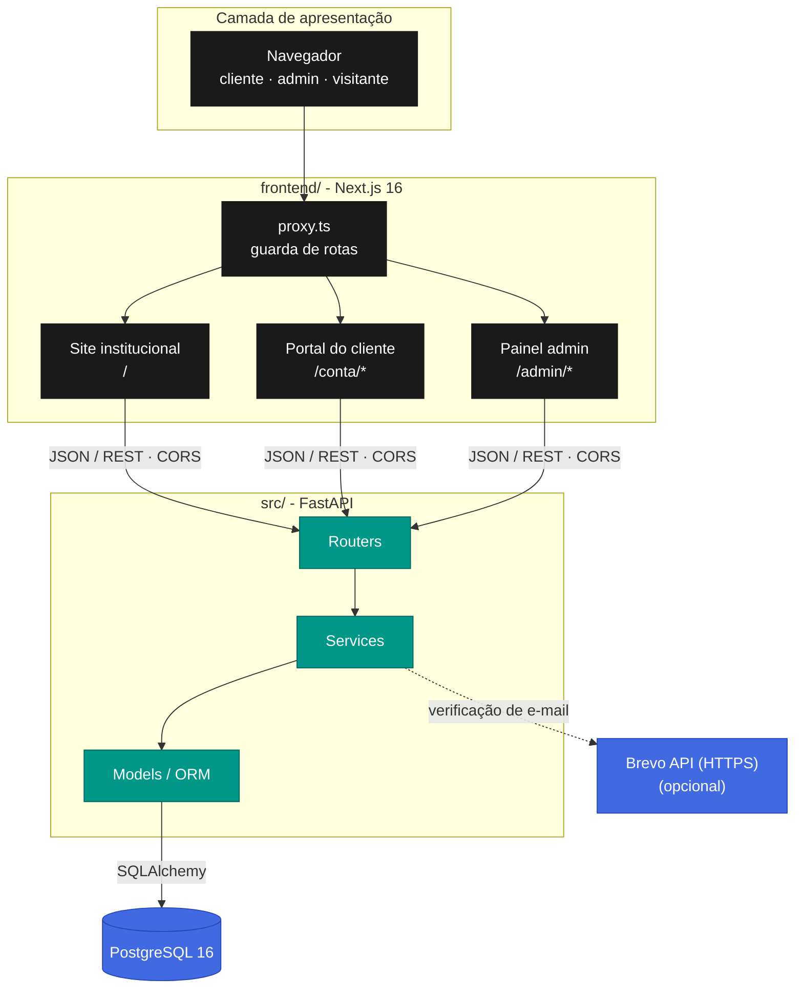
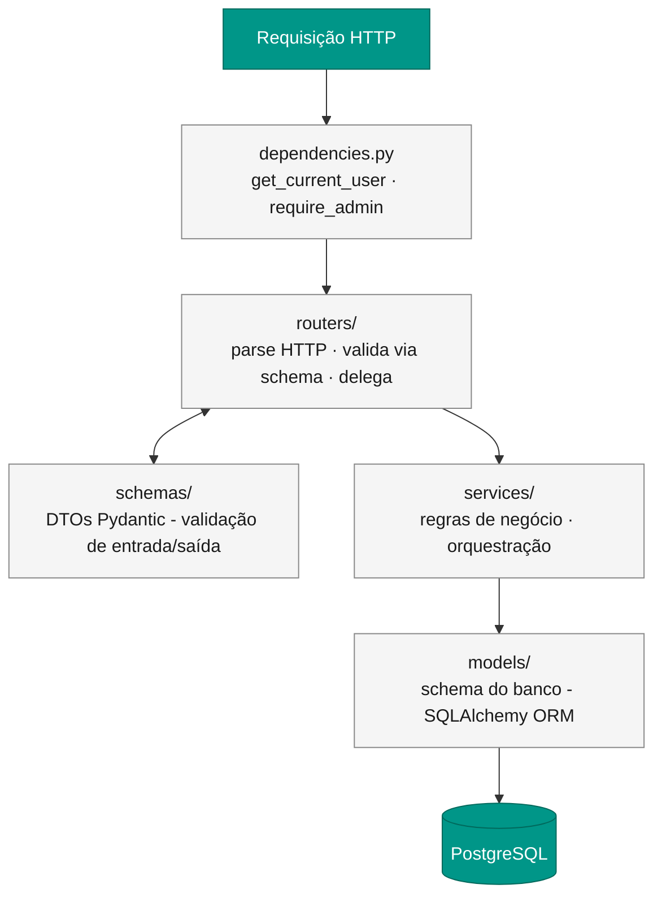
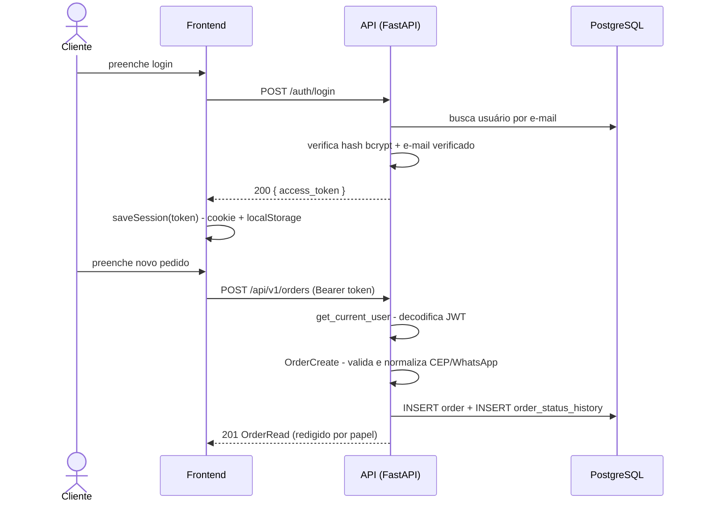
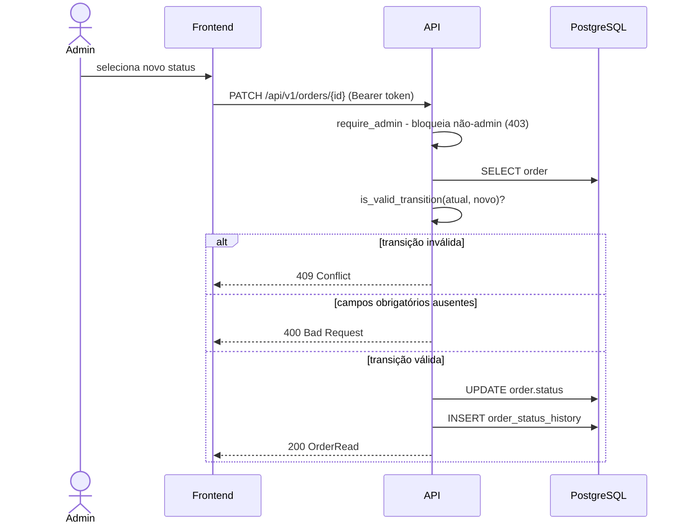
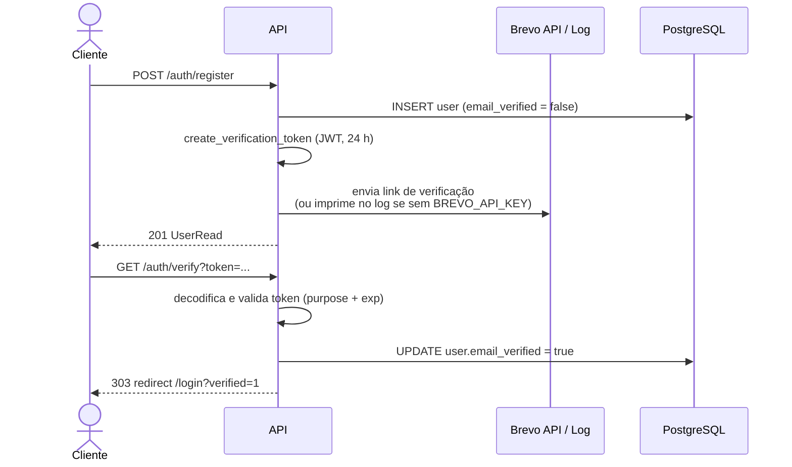
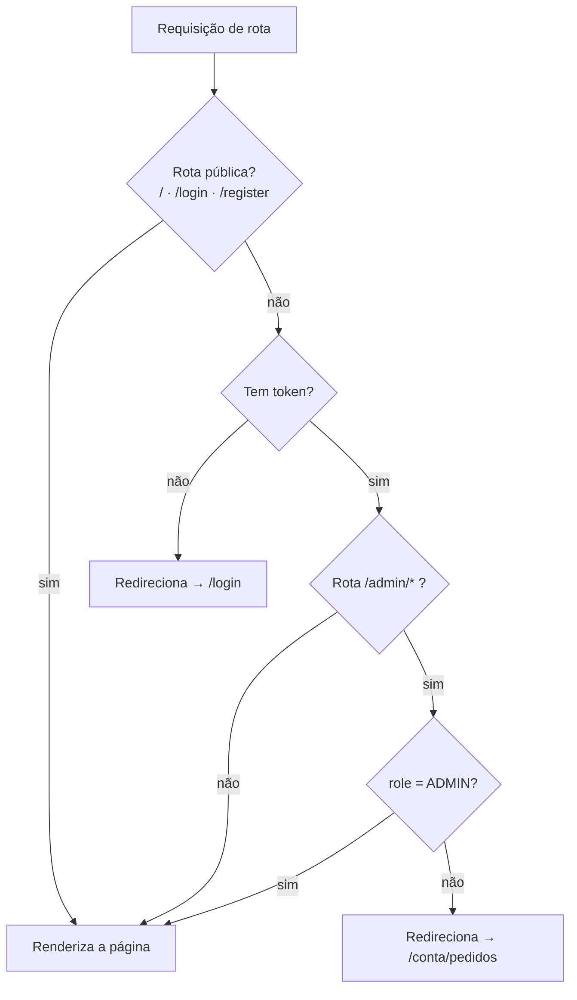
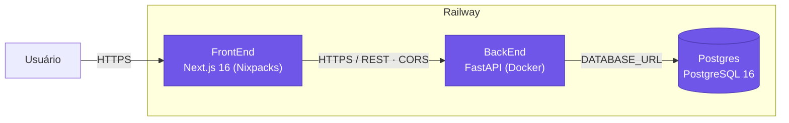

# Arquitetura

> Visão arquitetural da plataforma: estrutura do monorepo, camadas da API, fluxos de requisição e topologia de deploy.

## Sumário

- [Visão macro](#visão-macro)
- [Monorepo](#monorepo)
- [Arquitetura em camadas da API](#arquitetura-em-camadas-da-api)
- [Fluxos de requisição](#fluxos-de-requisição)
- [Arquitetura do frontend](#arquitetura-do-frontend)
- [Topologia de deploy](#topologia-de-deploy)
- [Decisões arquiteturais](#decisões-arquiteturais)

---

## Visão macro

A plataforma é composta por três peças que se comunicam por contratos bem definidos:



| Componente | Responsabilidade |
|---|---|
| **frontend/** | Renderizar a interface, gerir sessão no navegador, guardar rotas por papel |
| **src/** | Autenticar, aplicar regras de negócio, persistir dados, expor a API REST |
| **PostgreSQL** | Persistência durável - usuários, pedidos e histórico de status |
| **Brevo API** | Envio de e-mails de verificação de conta via HTTPS (opcional em desenvolvimento) |

---

## Monorepo

O repositório `ramos-planejados` reúne **dois deployáveis independentes** que evoluem e são publicados separadamente:

```
ramos-planejados/
├── src/        → API REST       → deploy: Railway (contêiner Docker)
└── frontend/   → Interface web  → deploy: Railway (Next.js via Nixpacks)
```

**Por que monorepo:** mantém o contrato de API (tipos TypeScript em `frontend/lib/api.ts` que espelham os schemas Pydantic em `src/schemas/`) sincronizado em um único histórico de versão, sem o atrito de coordenar dois repositórios.

---

## Arquitetura em camadas da API

A API segue **arquitetura em camadas** (*layered architecture*) com fluxo de dependência unidirecional. Cada camada só conhece a camada imediatamente abaixo.



### Responsabilidades e fronteiras

| Camada | Arquivo(s) | Faz | **Nunca faz** |
|---|---|---|---|
| **Dependências** | `dependencies.py` | Resolve o usuário do JWT, aplica `require_admin` | Regra de negócio |
| **Routers** | `routers/*.py` | Recebe HTTP, valida entrada (Pydantic), delega ao service, monta a resposta | Acessa o banco, contém regra de negócio |
| **Schemas** | `schemas/*.py` | Define DTOs de entrada/saída, valida e normaliza campos | Referencia modelos ORM diretamente |
| **Services** | `services/*.py` | Concentra a regra de negócio, orquestra operações no ORM | Importa de `routers/`, lida com objetos HTTP |
| **Models** | `models/*.py` | Define o schema do banco (tabelas, colunas, índices) | Contém lógica de negócio |

> **Regra de ouro:** a camada de serviço não conhece HTTP. Ela recebe objetos de domínio e parâmetros simples, e levanta `HTTPException` apenas para sinalizar violações de regra de negócio. Isso a torna testável de forma isolada - veja os testes unitários em `tests/unit/`.

### Anatomia de um endpoint

O endpoint `POST /api/v1/orders` ilustra a separação:

```python
# routers/orders.py - fino: valida, delega, serializa
@router.post("", status_code=201, response_model=OrderRead)
def create(body: OrderCreate, db: Session = Depends(get_db),
           current_user: User = Depends(get_current_user)) -> OrderRead:
    order = order_service.create_order(db, current_user, body)
    return order_service.serialize_order(order, viewer_is_admin=current_user.is_admin)
```

- `OrderCreate` (schema) já validou e normalizou WhatsApp, CEP e UF **antes** de o código do router rodar.
- `create_order` (service) aplica a regra: status inicial `AGUARDANDO_ANALISE` + primeira linha no histórico.
- `serialize_order` (service) monta a resposta redigindo campos conforme o papel de quem visualiza.

---

## Fluxos de requisição

### Fluxo 1 - Autenticação e criação de pedido



### Fluxo 2 - Avanço de status pelo admin



### Fluxo 3 - Verificação de e-mail



---

## Arquitetura do frontend

O frontend usa **Next.js 16 com App Router** - arquitetura *server-first*, em que componentes rodam no servidor por padrão e só recebem `"use client"` quando precisam de estado, eventos ou APIs do navegador.

```
frontend/app/
├── page.tsx              # / - site institucional (server component)
├── login · register      # autenticação (useActionState)
├── conta/                # área do cliente - exige JWT + e-mail verificado
│   ├── pedidos/          # lista · novo · detalhe
│   └── perfil/           # editar nome · trocar senha
└── admin/                # painel admin - exige JWT com role ADMIN
    ├── page.tsx          # dashboard
    └── pedidos/          # lista · novo · detalhe/gestão
```

### Camada de acesso à API e sessão

| Módulo | Responsabilidade |
|---|---|
| `lib/api.ts` | Funções de *fetch* tipadas + classe `ApiError` + tipos espelhados da API |
| `lib/auth.ts` | `saveSession` · `clearSession` · `getToken` · `getUser` · `isAdmin` |
| `lib/constants.ts` | Chaves de armazenamento (`TOKEN_KEY`, `USER_KEY`) - nunca *hardcoded* |
| `proxy.ts` | Guarda de rotas (middleware do Next.js 16) |

### Guarda de rotas

`proxy.ts` intercepta toda navegação **antes** da renderização:



O papel é lido diretamente do *payload* do JWT - sem chamada de API. É uma guarda de **navegação** (UX); a autorização real é sempre reaplicada no servidor pela API.

---

## Topologia de deploy

Os três serviços rodam na **Railway**, na mesma plataforma, com deploy automático a partir do GitHub:



| Deployável | Serviço Railway | Justificativa |
|---|---|---|
| `frontend/` | **FrontEnd** (Nixpacks) | Build automático do Next.js; `npm start` honra a porta injetada pelo Railway |
| `src/` | **BackEnd** (Docker) | Usa o `Dockerfile` da raiz; `entrypoint.sh` roda migrações + seed no boot |
| Banco | **Postgres** | Banco gerenciado; conexão via referência `${{Postgres.DATABASE_URL}}` |

O contêiner da API já está pronto para esse cenário: o `Dockerfile` produz uma imagem enxuta (Python 3.12-slim), roda como **usuário não-root**, lê toda a configuração do ambiente (princípio 12-factor) e expõe a porta via `$PORT`. O envio de e-mail usa a **Brevo API por HTTPS** porque a Railway bloqueia portas SMTP de saída.

> Deploy automático por *branch*: `develop` → ambiente de *staging*, `main` → produção. O pipeline de CI valida lint, tipos, testes e cobertura a cada PR antes do *merge*.

---

## Decisões arquiteturais

| Decisão | Alternativa considerada | Por que esta escolha |
|---|---|---|
| Arquitetura em camadas | Lógica direto nos *routers* | Isola a regra de negócio, deixa o *service* testável sem HTTP/banco |
| Monorepo | Dois repositórios | Mantém o contrato de API versionado junto, sincronizado |
| JWT *stateless* | Sessão em servidor | API sem estado escala horizontalmente sem *sticky sessions* |
| Histórico *append-only* | Campo `updated_by` mutável | Trilha de auditoria completa + base para métricas temporais |
| ORM exclusivo (sem SQL bruto) | SQL escrito à mão | Elimina superfície de SQL injection; *queries* tipadas |
| Serialização sensível a papel | Endpoints separados admin/cliente | Uma fonte de verdade; redação centralizada em `serialize_order` |
| Migrações com Alembic | `create_all` automático | Schema versionado e auditável; *upgrades* reproduzíveis |

Veja também: **[modelo-de-dados.md](modelo-de-dados.md)** · **[regras-de-negocio.md](regras-de-negocio.md)** · **[seguranca.md](seguranca.md)**.
