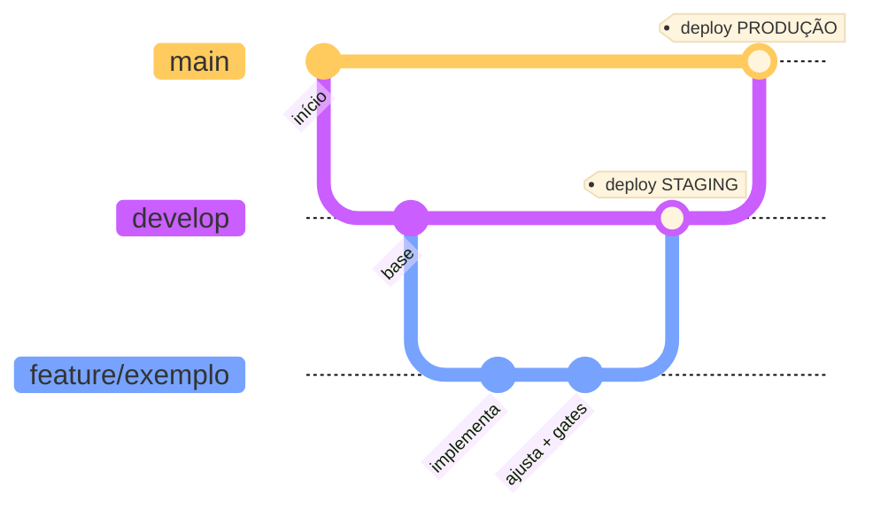
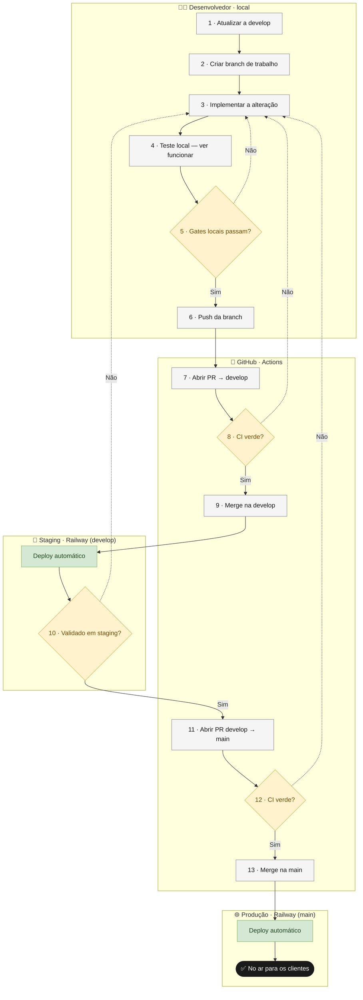

# Fluxo de trabalho — ambientes, branches e deploy

> Como uma alteração sai da sua máquina e chega aos clientes, passo a passo, sem quebrar nada.
> Este é o documento canônico do processo. O guia de setup local fica em
> [desenvolvimento.md](desenvolvimento.md).

## Sumário

- [Conceitos: branch × ambiente](#conceitos-branch--ambiente)
- [Os três ambientes](#os-três-ambientes)
- [As branches](#as-branches)
- [Diagrama 1 — Git Flow](#diagrama-1--git-flow)
- [O fluxo completo, passo a passo](#o-fluxo-completo-passo-a-passo)
- [Diagrama 2 — Pipeline CI/CD](#diagrama-2--pipeline-cicd)
- [Como fazer cada etapa](#como-fazer-cada-etapa)
- [Validar antes do staging](#validar-antes-do-staging)
- [Quem faz o quê](#quem-faz-o-quê)

---

## Conceitos: branch × ambiente

São coisas **diferentes** e é o ponto que mais confunde no começo:

- **Branch** = uma linha de código no Git (`main`, `develop`, `feature/*`).
- **Ambiente** = um lugar onde o app roda de verdade, no ar (produção, staging) — ou na sua
  máquina (local).

Cada branch **alimenta** um ambiente: quando a branch muda, o ambiente ligado a ela se atualiza.

> **Analogia.** Produção é a **loja aberta ao público** — se quebrar, o cliente vê. Staging é uma
> **loja-modelo idêntica e fechada**, onde você testa o móvel novo antes de expor. `develop` **não**
> é produção: é a linha que alimenta o staging.

---

## Os três ambientes

| Ambiente | Branch que alimenta | Onde roda | URL | Propósito | Dados |
|---|---|---|---|---|---|
| **Local** | `feature/*` (sua cópia) | sua máquina (`docker-compose` + `npm run dev`) | `localhost:3000` · `localhost:8000` | desenvolver e ver funcionar | descartáveis |
| **🧪 Staging** | `develop` | Railway — ambiente `staging` | `ramos-planejados-staging.up.railway.app` · `ramos-planejados-api-staging.up.railway.app` | homologação / teste antes de produção | de teste, **isolados** |
| **🌐 Produção** | `main` | Railway — ambiente `production` | `ramos-planejados.up.railway.app` · `ramos-planejados-api.up.railway.app` | sistema real, clientes reais | **reais** |

Cada ambiente na nuvem tem **banco PostgreSQL próprio** e **segredos próprios** (`SECRET_KEY`,
senha de admin) — um teste em staging **nunca** toca os dados de produção.

---

## As branches

São apenas **duas branches permanentes** (vivem para sempre, e são **protegidas** no GitHub —
push direto é bloqueado, inclusive para o dono):

- **`main`** → reflete o que está em **produção**.
- **`develop`** → reflete o que está em **staging** (integração/homologação).

Todo o resto são **branches temporárias** (*topic branches*): nascem da `develop`, viram um Pull
Request e são **apagadas no merge**. O prefixo indica o tipo:

| Prefixo | Para quê |
|---|---|
| `feature/` | nova funcionalidade |
| `fix/` | correção de bug |
| `chore/` | manutenção / infraestrutura |
| `docs/` | apenas documentação |

> **Regra de ouro:** nunca se escreve direto em `main` ou `develop`. Tudo passa por
> `feature/* → Pull Request → CI → merge`.

---

## Diagrama 1 — Git Flow

Como as branches se relacionam: a `feature` nasce da `develop`, volta para ela (deploy em
staging) e, quando validada, a `develop` é promovida para a `main` (deploy em produção).



---

## O fluxo completo, passo a passo

Cada decisão (losango) que der **"Não"** significa a mesma coisa: **volte ao passo 3**, corrija e
siga de novo. Nada avança enquanto a etapa anterior não estiver verde.

| # | Passo | O que é | Por quê |
|---|---|---|---|
| 1 | **Atualizar a `develop`** | trazer a versão mais recente para sua máquina | partir do trabalho mais atual; evita conflitos |
| 2 | **Criar a branch de trabalho** | uma branch nova só para esta alteração | isola o trabalho; nada toca `main`/`develop` ainda |
| 3 | **Implementar a alteração** | escrever o código ou editar a documentação | é o trabalho em si; ponto para onde você **volta** se algo falhar |
| 4 | **Teste local** | subir o app na sua máquina e **usar/ver** a alteração funcionando | validação **manual** — confirmar que faz o que deveria, com os olhos |
| 5 | **Gates locais passam?** *(decisão)* | rodar os checks **automáticos** (lint, tipos, testes, build) | pegar erro agora é mais barato que descobrir no PR |
| 6 | **Push da branch** | enviar a branch `feature/*` para o GitHub | o código precisa estar no GitHub para virar PR |
| 7 | **Abrir o PR → `develop`** | pedir para juntar a branch na `develop` | é a "porta" onde o CI roda e a mudança é revisada |
| 8 | **CI verde?** *(decisão)* | os jobs **Backend** e **Frontend** rodam sozinhos no PR | garante que nada quebrado entre na `develop` |
| 9 | **Merge na `develop`** | mesclar o PR aprovado | a alteração entra na linha de integração (staging) |
| → | **Deploy automático em STAGING** | o Railway publica sozinho ao detectar a mudança na `develop` | sua alteração passa a rodar num ambiente real de teste |
| 10 | **Validado em staging?** *(decisão)* | abrir o staging no navegador e testar o fluxo de verdade | última conferência antes dos clientes reais |
| 11 | **Abrir o PR `develop → main`** | promover o que está validado para produção | a `main` recebe pacotes testados, não cada feature avulsa |
| 12 | **CI verde?** *(decisão)* | os mesmos checks obrigatórios rodam de novo | nada quebrado chega à produção |
| 13 | **Merge na `main`** | mesclar a `develop` na `main` | marca um *release* |
| → | **Deploy automático em PRODUÇÃO** | o Railway publica sozinho ao detectar a mudança na `main` | a alteração chega aos clientes reais |

> A diferença entre o passo 4 e o 5: **Teste local** é você *abrindo e usando* a feature
> (validação manual, "ver funcionar"); **Gates locais** são as checagens *automáticas*. Os dois
> acontecem antes do push.

---

## Diagrama 2 — Pipeline CI/CD

O mesmo fluxo em **raias** (*swimlanes*), separando quem faz o quê. Legenda visual: **setas
cheias = "Sim"** (avança), **setas pontilhadas = "Não"** (voltam ao passo *Implementar*); as
**cores** distinguem os tipos — passos (cinza), decisões (âmbar), *deploys* (verde).



---

## Como fazer cada etapa

### Criar uma feature

```bash
git checkout develop && git pull          # 1 · partir do mais atual
git checkout -b feature/nome-curto        # 2 · branch de trabalho
# ... 3 · implementar ...
```

Use um nome curto e descritivo: `feature/recuperar-senha`, `fix/cep-invalido`,
`docs/fluxo-de-trabalho`.

### Testar localmente (passos 4 e 5)

```bash
# 4 · subir e VER funcionar (ver desenvolvimento.md para o setup completo)
docker-compose up -d
cd frontend && npm run dev                # abrir http://localhost:3000 e usar a feature

# 5 · gates automáticos (os mesmos que a CI roda)
docker-compose exec api ruff check src tests
docker-compose exec api mypy src
docker-compose exec api pytest --cov-fail-under=90
cd frontend && npm run lint && npm run type-check && npm run format:check && npm test && npm run build
```

> Os comandos completos e as notas de Windows estão em
> [desenvolvimento.md](desenvolvimento.md#gates-de-qualidade-rode-antes-de-abrir-um-pr).

### Abrir um Pull Request (passo 7)

Pela linha de comando:

```bash
git push -u origin feature/nome-curto     # 6 · enviar a branch
gh pr create --base develop               # 7 · abrir o PR contra develop
```

Ou pelo site: o GitHub mostra um aviso *"Compare & pull request"* logo após o push; clique,
confira o destino (**base: `develop`**), descreva e crie.

> **O PR é seu, mesmo quando o comando é digitado pelo assistente** — o `gh` usa a sua conta.
> Num time, *outra pessoa* revisa e aprova; aqui, sendo solo, você acumula os papéis: revisa o
> *diff* na aba **Files changed**, confere o CI verde e faz o merge.

### Validar em staging (passo 10)

Após o merge na `develop`, espere o deploy (1–3 min) e abra o **staging** no navegador:
`https://ramos-planejados-staging.up.railway.app`. Teste o fluxo real (login, criar pedido, etc.).
Acompanhe o deploy pelo painel do Railway ou pelos logs do serviço.

### Promover para produção (passos 11–13)

```bash
gh pr create --base main --head develop   # 11 · PR de promoção
# 12 · esperar CI verde
gh pr merge --squash                      # 13 · merge → deploy automático em produção
```

Confirme em `https://ramos-planejados-api.up.railway.app/health` (deve responder `200`).

---

## Validar antes do staging

Em um ambiente corporativo, uma feature é validada **antes** de ocupar o staging. Há duas camadas:

**Camada 1 — Teste local (principal, grátis e rápida).** É o passo 4: você sobe o app na sua
máquina e usa a funcionalidade. Cobre a maior parte dos casos e não custa nada.

**Camada 2 — Ambiente de *preview* efêmero por PR (o jeito profissional).** O Railway oferece
**PR Environments**: ao abrir um PR, ele cria **um ambiente isolado só para aquele PR** (serviços,
banco e URL próprios) e o **destrói automaticamente** quando o PR é mesclado ou fechado. Assim
qualquer pessoa abre a URL do PR e testa a feature **sem poluir o staging**. O custo é proporcional
ao tempo de uso (algumas horas por revisão).

> **Status neste projeto:** documentado como conceito; **não habilitado**. Para o tamanho atual, a
> Camada 1 já cobre bem. Quando fizer sentido (mais colaboradores, features visuais que precisam de
> aprovação), habilita-se em *Settings → Environments* do projeto no Railway.
> Referência: [Preview Deployments with PR Environments — Railway Docs](https://docs.railway.com/guides/preview-deployments-with-pr-environments).

---

## Quem faz o quê

| Ator | Responsabilidade |
|---|---|
| **Desenvolvedor** (local) | implementar, testar localmente, rodar os gates, abrir os PRs, validar em staging e fazer os *merges* |
| **GitHub Actions** (CI) | rodar os jobs **Backend** e **Frontend** em cada PR; bloquear merge se algo falhar |
| **GitHub** (branch protection) | exigir PR + CI verde; impedir push direto em `main`/`develop` |
| **Railway** (CD) | observar `develop`/`main` e fazer o **deploy automático** no ambiente certo |

---

Veja também: **[desenvolvimento.md](desenvolvimento.md)** (setup, comandos, troubleshooting) ·
**[arquitetura.md](arquitetura.md)** (topologia de deploy).
