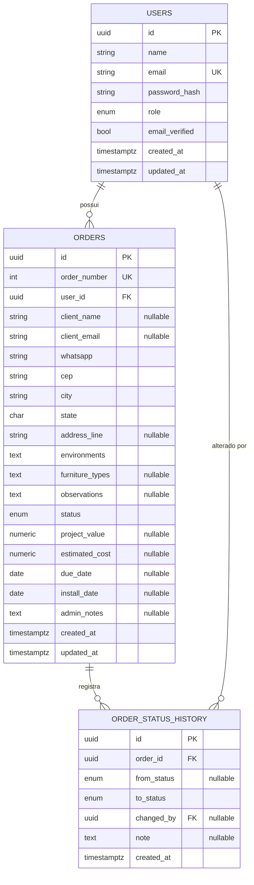

# Modelo de dados

> Schema do banco de dados: entidades, relacionamentos, colunas, índices e estratégia de migração.

## Sumário

- [Diagrama entidade-relacionamento](#diagrama-entidade-relacionamento)
- [Tabela `users`](#tabela-users)
- [Tabela `orders`](#tabela-orders)
- [Tabela `order_status_history`](#tabela-order_status_history)
- [Índices](#índices)
- [Tipos enumerados](#tipos-enumerados)
- [Estratégia de migração](#estratégia-de-migração)

---

## Diagrama entidade-relacionamento



### Relacionamentos

| Relacionamento | Cardinalidade | Regra de exclusão | Motivo |
|---|---|---|---|
| `users` → `orders` | 1 : N | `ON DELETE RESTRICT` | Impede apagar um usuário que tenha pedidos |
| `orders` → `order_status_history` | 1 : N | `ON DELETE CASCADE` | O histórico não existe sem o pedido |
| `users` → `order_status_history` (`changed_by`) | 1 : N | `ON DELETE SET NULL` | Preserva o histórico mesmo se o autor for removido |

---

## Tabela `users`

Contas de acesso ao sistema - clientes e administradores.

| Coluna | Tipo | Restrições | Descrição |
|---|---|---|---|
| `id` | `UUID` | PK, default `gen_random_uuid()` | Identificador |
| `name` | `VARCHAR(255)` | NOT NULL | Nome completo |
| `email` | `VARCHAR(255)` | NOT NULL, **UNIQUE** | E-mail de login |
| `password_hash` | `VARCHAR(255)` | NOT NULL | Hash bcrypt - nunca exposto em respostas |
| `role` | `user_role` (enum) | NOT NULL, default `CUSTOMER` | Papel do usuário |
| `email_verified` | `BOOLEAN` | NOT NULL, default `false` | Se o e-mail foi confirmado |
| `created_at` | `TIMESTAMPTZ` | NOT NULL, default `now()` | Data de criação |
| `updated_at` | `TIMESTAMPTZ` | NOT NULL, default `now()`, `ON UPDATE` | Última atualização |

---

## Tabela `orders`

O pedido de móvel sob medida - entidade central do domínio.

| Coluna | Tipo | Restrições | Descrição |
|---|---|---|---|
| `id` | `UUID` | PK, default `gen_random_uuid()` | Identificador |
| `order_number` | `INTEGER` | NOT NULL, UNIQUE, `nextval` | Número sequencial legível (`#0001`) |
| `user_id` | `UUID` | FK → `users.id`, NOT NULL | Dono do pedido |
| `client_name` | `VARCHAR(255)` | nullable | Nome - só em pedidos de balcão |
| `client_email` | `VARCHAR(254)` | nullable | E-mail - só em pedidos de balcão |
| `whatsapp` | `VARCHAR(20)` | NOT NULL | Telefone normalizado (10-11 dígitos) |
| `cep` | `VARCHAR(9)` | NOT NULL | CEP no formato `NNNNN-NNN` |
| `city` | `VARCHAR(120)` | NOT NULL | Cidade |
| `state` | `CHAR(2)` | NOT NULL | UF |
| `address_line` | `VARCHAR(255)` | nullable | Rua, número, complemento |
| `environments` | `TEXT` | NOT NULL | Ambientes de interesse |
| `furniture_types` | `TEXT` | nullable | Tipos de móveis |
| `observations` | `TEXT` | nullable | Observações livres do cliente |
| `status` | `order_status` (enum) | NOT NULL, default `AGUARDANDO_ANALISE` | Status atual |
| `project_value` | `NUMERIC(10,2)` | nullable | Valor do projeto (definido pelo admin) |
| `estimated_cost` | `NUMERIC(10,2)` | nullable | Custo estimado (admin only) |
| `due_date` | `DATE` | nullable | Previsão de entrega |
| `install_date` | `DATE` | nullable | Data de instalação |
| `admin_notes` | `TEXT` | nullable | Notas internas (admin only) |
| `created_at` | `TIMESTAMPTZ` | NOT NULL, default `now()` | Data de criação |
| `updated_at` | `TIMESTAMPTZ` | NOT NULL, default `now()`, `ON UPDATE` | Última atualização |

> **`order_number`** é alimentado por uma *sequence* dedicada (`orders_number_seq`), garantindo numeração contínua e legível independentemente do UUID interno.
>
> **`NUMERIC(10,2)`** é o tipo correto para dinheiro - evita os erros de arredondamento de `float`.

---

## Tabela `order_status_history`

Trilha de auditoria **append-only** de toda mudança de status.

| Coluna | Tipo | Restrições | Descrição |
|---|---|---|---|
| `id` | `UUID` | PK, default `gen_random_uuid()` | Identificador |
| `order_id` | `UUID` | FK → `orders.id` (CASCADE), NOT NULL | Pedido relacionado |
| `from_status` | `order_status` (enum) | nullable | Status anterior (`null` na criação) |
| `to_status` | `order_status` (enum) | NOT NULL | Novo status |
| `changed_by` | `UUID` | FK → `users.id` (SET NULL), nullable | Quem realizou a mudança |
| `note` | `TEXT` | nullable | Nota opcional da transição |
| `created_at` | `TIMESTAMPTZ` | NOT NULL, default `now()` | Momento exato da transição |

Esta tabela nunca recebe `UPDATE` nem `DELETE` direto - apenas `INSERT`. É a base de auditoria e a fonte das métricas temporais do dashboard.

---

## Índices

Índices criados além das chaves primárias e *unique constraints*, voltados às colunas mais usadas em filtros e *joins*:

| Índice | Tabela | Colunas | Otimiza |
|---|---|---|---|
| `ix_orders_user_id` | `orders` | `user_id` | Listagem dos pedidos de um cliente |
| `ix_orders_status` | `orders` | `status` | Filtro por status no painel admin |
| `ix_orders_user_id_status` | `orders` | `user_id, status` | Filtro composto (cliente + status) |
| `ix_orders_created_at` | `orders` | `created_at` | Ordenação por data, pedidos recentes |
| `ix_order_status_history_order_id_created_at` | `order_status_history` | `order_id, created_at` | Linha do tempo de um pedido, em ordem |

---

## Tipos enumerados

O PostgreSQL armazena dois tipos `ENUM` nativos - mais íntegros e legíveis que strings livres ou códigos numéricos.

**`user_role`**

```
CUSTOMER · ADMIN
```

**`order_status`**

```
AGUARDANDO_ANALISE · EM_ORCAMENTO · APROVADO · EM_PRODUCAO
INSTALACAO_AGENDADA · CONCLUIDO · CANCELADO
```

---

## Estratégia de migração

O schema é versionado com **Alembic**. Cada alteração de modelo gera uma migração numerada em `migrations/versions/`, aplicada em ordem.

| Migração | O que introduz |
|---|---|
| `2f49bf7193e9` | Criação inicial de `users` e `orders` |
| `0002_expand_orders` | Schema de gestão completo: lifecycle de 7 estados, endereço, campos financeiros e a tabela `order_status_history` |
| `0003` | Verificação de e-mail e campos de texto livre no pedido |
| `0004` | Coluna `client_email` para pedidos de balcão |

**Comandos** (dentro do contêiner):

```bash
# Aplicar todas as migrações pendentes
docker-compose exec api alembic upgrade head

# Gerar uma nova migração após alterar um modelo
docker-compose exec api alembic revision --autogenerate -m "descrição da mudança"

# Reverter a última migração
docker-compose exec api alembic downgrade -1
```

> O schema **nunca** é criado via `Base.metadata.create_all`. Toda mudança passa por uma migração revisável - o estado do banco é reproduzível e auditável em qualquer ambiente.

Veja também: **[arquitetura.md](arquitetura.md)** · **[regras-de-negocio.md](regras-de-negocio.md)**.
