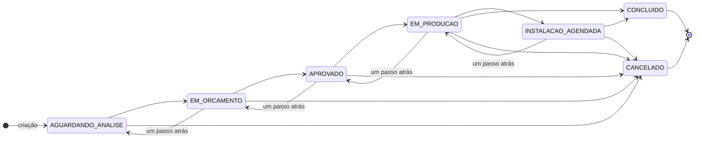

# Regras de negócio

> Comportamento esperado do sistema: ciclo de vida do pedido, regras operacionais, validações e a matriz de permissões por papel.

## Sumário

- [Papéis de usuário](#papéis-de-usuário)
- [Ciclo de vida do pedido](#ciclo-de-vida-do-pedido)
- [Máquina de estados](#máquina-de-estados)
- [Campos obrigatórios por transição](#campos-obrigatórios-por-transição)
- [Validações de data](#validações-de-data)
- [Propriedade e edição de pedidos](#propriedade-e-edição-de-pedidos)
- [Regras financeiras](#regras-financeiras)
- [Histórico de status](#histórico-de-status)
- [Pedidos de balcão](#pedidos-de-balcão)
- [Matriz de permissões](#matriz-de-permissões)
- [Catálogo de regras](#catálogo-de-regras)

---

## Papéis de usuário

| Papel | Descrição | Como é atribuído |
|---|---|---|
| `CUSTOMER` | Cliente final que encomenda um móvel sob medida | Cadastro público (`POST /auth/register`) |
| `ADMIN` | Dono ou operador da marcenaria | **Apenas** via script de seed (`seed_admin`) |

> **Não existe escalonamento de papel por API.** Nenhum endpoint promove um usuário a admin. O cadastro público sempre produz um `CUSTOMER`. O primeiro admin é criado fora de banda, lendo as credenciais de variáveis de ambiente.

---

## Ciclo de vida do pedido

Todo pedido nasce em `AGUARDANDO_ANALISE` e percorre uma sequência de estados até um estado terminal.

| Status | Rótulo (PT) | Significado |
|---|---|---|
| `AGUARDANDO_ANALISE` | Aguardando análise | Pedido recém-criado, aguardando triagem |
| `EM_ORCAMENTO` | Em orçamento | Admin elaborando a proposta de preço |
| `APROVADO` | Aprovado | Orçamento definido, pronto para produção |
| `EM_PRODUCAO` | Em produção | Móveis sendo fabricados |
| `INSTALACAO_AGENDADA` | Instalação agendada | Data de instalação combinada com o cliente |
| `CONCLUIDO` | Concluído | Projeto entregue — **estado terminal** |
| `CANCELADO` | Cancelado | Pedido encerrado — **estado terminal, sem reversão** |

---

## Máquina de estados

### Regras de transição

A função `is_valid_transition` (`src/services/order.py`) aceita exatamente três tipos de transição:

1. **Um passo para frente** ao longo da sequência principal.
2. **Um passo para trás** — para corrigir um avanço indevido (ex.: `APROVADO → EM_ORCAMENTO`).
3. **Para `CANCELADO`** — a partir de qualquer estado não-terminal.

Qualquer outra transição (pular etapas, reverter dois passos, sair de um estado terminal) retorna **HTTP 409 Conflict**.

> A adjacência de `EM_PRODUCAO` tem duas saídas para frente: o pedido pode ir para `INSTALACAO_AGENDADA` ou seguir direto para `CONCLUIDO` (quando não há instalação a agendar).

### Estados terminais

- `CONCLUIDO` e `CANCELADO` **não têm transições de saída**.
- Pedidos cancelados **não podem ser reativados**.
- Pedidos concluídos **não podem ser reabertos**.

---

## Campos obrigatórios por transição

Alguns estados só podem ser atingidos se determinados campos já estiverem preenchidos. A regra é verificada no servidor **antes** de aplicar a transição.

| Transição para | Campos exigidos pelo servidor |
|---|---|
| `APROVADO` | `project_value` **e** `due_date` |
| `INSTALACAO_AGENDADA` | `install_date` |

Se faltar algum campo, a API retorna **HTTP 400** com a mensagem indicando o que falta.

> O frontend de gestão reforça essa regra antes mesmo de chamar a API e, na tela de aprovação, também solicita `estimated_cost` para que o lucro possa ser calculado. A validação obrigatória no servidor é a de `project_value` + `due_date`.

---

## Validações de data

Aplicadas na atualização de pedido (`PATCH /api/v1/orders/{id}`):

| Regra | Resultado |
|---|---|
| `due_date` **nova** no passado | Rejeitado — HTTP 400 |
| `install_date` **nova** no passado | Rejeitado — HTTP 400 |
| `install_date` anterior a `due_date` | Rejeitado — HTTP 400 |
| Data **já existente** reenviada sem alteração | Permitido — o servidor detecta que o valor não mudou |

A distinção "nova" vs. "existente" é importante: o formulário de edição reenvia o pedido inteiro, inclusive datas antigas que já passaram. O servidor só rejeita uma data no passado se ela for **diferente** do valor atual do pedido.

---

## Propriedade e edição de pedidos

- Todo pedido pertence a um usuário, identificado por `user_id`.
- O `order_number` (número sequencial legível, ex.: `#0001`) é gerado pelo banco e é **imutável**.
- O **cliente cria** pedidos, mas **não os modifica** depois de enviados.
- Apenas o **admin** edita pedidos após a criação.

### Janela de edição dos dados do cliente

O admin só pode editar os **dados de cliente e projeto** (WhatsApp, endereço, ambientes, tipos de móveis, observações) enquanto o pedido estiver em `AGUARDANDO_ANALISE`. Depois disso, esses campos ficam congelados.

Os **campos de gestão** (status, valores, prazos, notas internas) são editáveis pelo admin **em qualquer status**.

| Grupo de campos | Editável pelo admin |
|---|---|
| Dados do cliente / projeto | Apenas em `AGUARDANDO_ANALISE` |
| Campos de gestão (status, valores, datas, notas) | Sempre |

---

## Regras financeiras

| Regra | Detalhe |
|---|---|
| `project_value` oculto ao cliente | Visível apenas após o pedido sair de `AGUARDANDO_ANALISE` |
| `estimated_cost` e `profit` | **Sempre** ocultos ao cliente |
| `admin_notes` | **Sempre** oculto ao cliente |
| Lucro (`profit`) | Calculado: `project_value − estimated_cost`, apenas quando ambos existem |
| Dashboard financeiro | Considera apenas pedidos que atingiram `CONCLUIDO` no mês selecionado |

A redação desses campos é centralizada na função `serialize_order` — a mesma entidade `Order` produz uma resposta diferente para cliente e para admin.

---

## Histórico de status

Cada mudança de status gera **uma linha** na tabela `order_status_history`:

- A primeira entrada (criação do pedido) tem `from_status = null` e a nota `"Pedido criado"`.
- Toda transição posterior registra `from_status`, `to_status`, o admin responsável (`changed_by`) e uma `note` opcional.
- O histórico é **imutável** — *append-only*. Nunca é editado nem deletado.

Esse histórico cumpre dois papéis: trilha de auditoria e fonte de dados para métricas temporais (ex.: o dashboard usa a data de entrada em `CONCLUIDO` para calcular o faturamento do mês).

---

## Pedidos de balcão

Para clientes que chegam à marcenaria sem conta no sistema (*walk-in*), o admin cria o pedido em `/admin/pedidos/novo`:

- O formulário aceita dois campos extras opcionais: `client_name` e `client_email`.
- Esses campos só são considerados quando quem cria é admin — um cliente comum que os enviasse os teria ignorados.
- Tecnicamente, o pedido é associado ao `user_id` do admin que o criou, mas a identidade exibida (`customer_name` / `customer_email`) prioriza os dados de balcão.

---

## Matriz de permissões

| Ação | `CUSTOMER` | `ADMIN` |
|---|:---:|:---:|
| Criar conta | ✓ (público) | — |
| Ver os próprios pedidos | ✓ | ✓ |
| Ver todos os pedidos | ✗ | ✓ |
| Filtrar pedidos por status | ✗ | ✓ |
| Criar pedido | ✓ | ✓ |
| Alterar status do pedido | ✗ | ✓ |
| Editar dados de cliente/projeto | ✗ | ✓ (só em `AGUARDANDO_ANALISE`) |
| Definir `project_value` / `estimated_cost` | ✗ | ✓ |
| Ver `project_value` | ✓ (após `AGUARDANDO_ANALISE`) | ✓ (sempre) |
| Ver `estimated_cost` / `profit` | ✗ | ✓ |
| Ver `admin_notes` | ✗ | ✓ |
| Ver nome/e-mail do cliente no pedido | ✗ | ✓ |
| Acessar o dashboard | ✗ | ✓ |
| Cancelar pedido | ✗ | ✓ |
| Editar o próprio nome / trocar senha | ✓ | ✓ |

---

## Catálogo de regras

Referência consolidada — cada regra tem um identificador estável (`BR-n`).

| ID | Regra |
|---|---|
| **BR-1** | Todo pedido nasce no status `AGUARDANDO_ANALISE`. |
| **BR-2** | Apenas o admin altera um pedido (status, valores, datas, notas). |
| **BR-3** | O cliente lê apenas os próprios pedidos. |
| **BR-4** | Toda operação sobre pedido exige autenticação. |
| **BR-5** | O papel do usuário é determinado pelo campo `role` (`CUSTOMER` ou `ADMIN`). |
| **BR-6** | O e-mail é único por conta de usuário. |
| **BR-7** | O cliente cria pedidos; apenas o admin os modifica depois. |
| **BR-8** | A transição de status é um passo à frente, um passo atrás, ou cancelamento de estado não-terminal. Qualquer outra → HTTP 409. |
| **BR-9** | O papel `ADMIN` só é concedido pelo script de seed. Não há escalonamento por API. |
| **BR-10** | Toda mudança de status anexa uma linha a `order_status_history`. |
| **BR-11** | `project_value` é oculto ao cliente enquanto o pedido estiver em `AGUARDANDO_ANALISE`. |
| **BR-12** | `estimated_cost`, `profit` e `admin_notes` são sempre ocultos ao cliente. |
| **BR-13** | Os dados de cliente/projeto só são editáveis enquanto o pedido estiver em `AGUARDANDO_ANALISE`. |
| **BR-14** | O `order_number` é sequencial, gerado pelo banco e imutável. |
| **BR-15** | O login só é permitido após a verificação do e-mail. |

Veja também: **[api.md](api.md)** para os contratos de endpoint · **[modelo-de-dados.md](modelo-de-dados.md)** para o schema.
