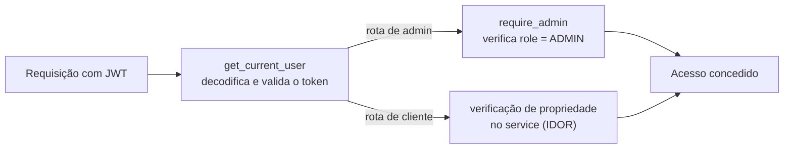

# Segurança

> Modelo de segurança da plataforma: autenticação, autorização, proteção de dados e os testes adversariais que comprovam cada mitigação.

A segurança foi tratada como requisito de primeira ordem. As decisões seguem o **OWASP ASVS** (*Application Security Verification Standard*) e cada uma tem um teste adversarial correspondente em `tests/security/`.

## Sumário

- [Autenticação](#autenticação)
- [Autorização](#autorização)
- [Proteção de dados sensíveis](#proteção-de-dados-sensíveis)
- [Proteção contra abuso](#proteção-contra-abuso)
- [Superfície de ataque](#superfície-de-ataque)
- [Gestão de segredos](#gestão-de-segredos)
- [Testes de segurança](#testes-de-segurança)

---

## Autenticação

### Armazenamento de senhas

- Senhas são armazenadas **exclusivamente como hash bcrypt** (via `passlib`).
- O hash **nunca** é retornado em nenhuma resposta da API, nem registrado em log.
- A troca de senha (`PATCH /api/v1/me/password`) exige a senha atual.

### Tokens JWT

| Propriedade | Valor | Justificativa |
|---|---|---|
| Algoritmo | `HS256` - **fixo** | Impede o ataque de confusão de algoritmo (`alg: none`) |
| Chave de assinatura | `SECRET_KEY`, mínimo 32 caracteres, lida só do ambiente | Nunca versionada |
| Validade | 24 horas | Limita a janela de uso de um token vazado |
| *Payload* | `sub` (UUID), `role`, `exp` | O mínimo necessário, sem dados sensíveis |

A configuração `algorithm: Literal["HS256"]` em `config.py` torna impossível, por construção, aceitar um token assinado com outro algoritmo.

### Verificação de e-mail

- Contas novas nascem com `email_verified = false` e **não conseguem fazer login** antes de confirmar o e-mail.
- O link de verificação é um JWT com `purpose: email_verify` e validade de 24 h - o `purpose` impede que um token de acesso seja reaproveitado como token de verificação.

### Defesa contra enumeração de usuários

Dois cuidados impedem que um atacante descubra quais e-mails existem:

1. **Resposta uniforme no login.** E-mail inexistente e senha errada retornam exatamente a mesma mensagem `"invalid credentials"` (OWASP ASVS 2.2.2).
2. **Resposta uniforme no reenvio de verificação.** `POST /auth/resend-verification` devolve sempre a mesma mensagem, exista ou não o e-mail.

### Defesa contra *timing attack*

Quando o e-mail informado no login não existe, o código ainda executa `pwd_context.dummy_verify()` - uma verificação de hash "vazia". Sem isso, a ausência do trabalho de hashing tornaria a resposta mensuravelmente mais rápida, vazando a informação "este e-mail não existe" pelo tempo de resposta.

---

## Autorização

### Dois níveis de verificação



| Mecanismo | Onde | O que faz |
|---|---|---|
| `get_current_user` | `dependencies.py` | Decodifica o JWT, valida, resolve o usuário - 401 se inválido |
| `require_admin` | `dependencies.py` | Bloqueia não-admins em rotas de admin - 403 |
| Verificação de propriedade | `services/order.py` | Cliente só acessa os próprios pedidos |

### Proteção contra IDOR

*Insecure Direct Object Reference* - acessar o recurso de outro usuário trocando o ID na URL.

`get_order` compara `order.user_id` com o usuário autenticado: se um cliente tenta ler o pedido de outro, recebe **HTTP 403**. A guarda fica na **camada de serviço**, não no router - qualquer caminho que chegue ao pedido passa por ela.

### Sem escalonamento de papel

Nenhum endpoint concede ou revoga o papel `ADMIN`. O cadastro público sempre cria um `CUSTOMER`. O primeiro admin é criado fora de banda pelo script `seed_admin`, que lê as credenciais de variáveis de ambiente.

---

## Proteção de dados sensíveis

### Serialização sensível ao papel

A mesma entidade `Order` é exposta de formas diferentes conforme quem visualiza. A função `serialize_order` concentra essa redação:

| Campo | Cliente | Admin |
|---|:---:|:---:|
| `estimated_cost`, `profit`, `admin_notes` | sempre `null` | visível |
| `customer_name`, `customer_email` | sempre `null` | visível |
| `project_value` | só após `AGUARDANDO_ANALISE` | sempre visível |

Como a redação é feita na serialização - e não escondida só na UI - o dado sensível **nunca sai da API** para um cliente, mesmo que ele chame o endpoint diretamente.

### CORS

A API só aceita requisições de navegador vindas da origem configurada em `FRONTEND_ORIGIN`, e apenas com os métodos `GET`, `POST` e `PATCH`. Cabeçalhos permitidos: `Authorization` e `Content-Type`.

---

## Proteção contra abuso

### Rate limiting

Implementado com `slowapi`, por IP de origem:

| Endpoint | Limite | Protege contra |
|---|---|---|
| `POST /auth/login` | 10 req/min | Força bruta de senha (OWASP ASVS 2.2.5) |
| `POST /auth/resend-verification` | 5 req/min | Abuso do envio de e-mails |

Ao exceder o limite, a API responde **HTTP 429** com uma mensagem clara.

### Validação de entrada

Toda requisição passa por um schema Pydantic **antes** de chegar à camada de serviço:

- Limites de tamanho em todos os campos de texto (evita *payloads* gigantes).
- Normalização de dados (WhatsApp e CEP reduzidos a dígitos; UF em maiúsculas).
- `EmailStr` valida o formato do e-mail, incluindo o TLD.
- IDs de rota são tipados como `UUID` - um valor malformado é rejeitado com 422 antes de qualquer consulta.

---

## Superfície de ataque

| Vetor | Mitigação |
|---|---|
| **SQL Injection** | Todo acesso a dados passa pelo ORM (SQLAlchemy). Não há interpolação de SQL bruto em nenhum ponto. |
| **Injeção de comando** | O código não invoca *shell*; nenhuma chamada de subprocesso com `shell=True`. |
| **Exposição de dados internos** | Mensagens de erro seguem a forma `{ "detail": "..." }` e não revelam *stack traces* nem estado interno. |
| **Container como root** | O `Dockerfile` cria um usuário `app` não-privilegiado e roda a aplicação com ele. |
| **Dependências não-controladas** | A stack é fixada em `pyproject.toml` / `package.json`; novas dependências exigem aprovação explícita. |

---

## Gestão de segredos

- **Nenhum segredo é versionado.** `.env` está no `.gitignore`; o repositório contém apenas `.env.example` com valores de exemplo.
- Toda configuração sensível (`DATABASE_URL`, `SECRET_KEY`, `BREVO_API_KEY`) vem de variável de ambiente, validada na inicialização por `pydantic-settings` - a aplicação **não sobe** com uma configuração inválida.
- Segredos como `SECRET_KEY` e `ADMIN_PASSWORD` usam o tipo `SecretStr`, que evita o vazamento acidental do valor em *logs* ou *reprs*.
- Os logs nunca registram senhas, tokens ou dados pessoais.

---

## Testes de segurança

A pasta `tests/security/` contém **apenas testes adversariais** - nenhum teste de caminho feliz. Cada classe de ataque do OWASP relevante tem cobertura dedicada:

| Arquivo | Classe de ataque | Cenários |
|---|---|---|
| `test_authentication.py` | Ataques a JWT | Token ausente, expirado, assinatura adulterada, bypass `alg:none` |
| `test_authorization.py` | IDOR e escalonamento | Cliente acessando pedido de outro, cliente chamando rota de admin |
| `test_input_validation.py` | Injeção e entrada malformada | *Payloads* de SQL injection, campos gigantes, UUIDs inválidos |
| `test_rate_limiting.py` | Força bruta | 11ª tentativa de login dentro da janela → 429 |
| `test_information_disclosure.py` | Vazamento de informação | Erro uniforme de login; `password_hash` nunca presente em resposta |

```bash
# Rodar apenas a suíte de segurança
docker-compose exec api pytest -m security -v
```

> Todos os testes de segurança devem passar antes de qualquer *deploy*. O fluxo de trabalho do projeto prevê uma revisão de segurança (`/security-review`) obrigatória antes de publicar em produção.

Veja também: **[arquitetura.md](arquitetura.md)** · **[regras-de-negocio.md](regras-de-negocio.md)**.
